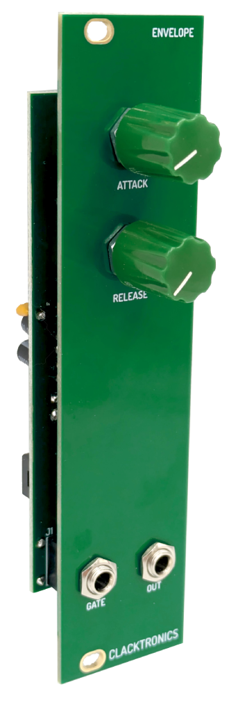

# BYOM Modules

In this repository is all the modules in the book for **Build Your Own Modular** the Clacktronics ring binder product to build your own modular synthesizer from scratch. [clacktronics.co.uk/byom/](http://clacktronics.co.uk/byom/). These are the original project files PCB and panel With branding removed, they are not the pages which are panels I make up from these files. It does not include the text of the book either. I have provided these as a starting point for your own projects and ideas, I do not mind if they are used commercially, all I ask for is attribution to my original physical design and for them not to be sold under my brand name **Clacktronics**.

## PSU

A simple PSU that uses the 12V direct and creates a -12V using a cheap through hole MC34063
[PSU Schematic](pdf_schematics/BYOM_PSU_main.pdf)

## VCO

A paired down sawtooth VCO that can do a couple of octaves, uses only TL074
[PSU Schematic](pdf_schematics/BYOM_VCO_main.pdf)

## VCA

Simple dual VCA using the LM13700
[PSU Schematic](pdf_schematics/BYOM_VCA_main.pdf)

## VCF

A gritty sounding VCF using the LM13700
[PSU Schematic](pdf_schematics/BYOM_VCF_main.pdf)

## ATTENUVERTER

Performs basic attunuation and inversion of CV signals
[PSU Schematic](pdf_schematics/BYOM_Attenuverter_main.pdf)

## MIXER

Mixes CV and Audio signals
[PSU Schematic](pdf_schematics/BYOM_Mixer_main.pdf)

## LFO

Simple LFO that has shape and frequency controls
[PSU Schematic](pdf_schematics/BYOM_LFO_main.pdf)

## ENVELOPE

Simple AR generator
[PSU Schematic](pdf_schematics/BYOM_Envelope_main.pdf)

## MICROCONTROLLER

Raspberry Pi Pico based experimental board
[PSU Schematic](pdf_schematics/BYOM_Micro_main.pdf)

## PASSIVE MULT

Helps connect CV outputs together

## POWER BUS
Simple passive power bus

## BLANK
Pretty blank plate

